# CUGA Agent 系統架構

## 概述
CUGA (Conversational Unified Generative Agent) 是一個多層次的 AI Agent 系統，能夠處理複雜的用戶查詢，通過任務分解、API 調用和程式碼生成來完成任務。

## 完整架構流程圖

```mermaid
flowchart TB
    %% ========= 用戶與頂層 Agent =========
    User["👤 User<br/>用戶"] -->|用戶查詢| ChatAgent["💬 ChatAgent (可選)<br/>對話管理器<br/>────<br/>多輪對話與上下文管理<br/>⚙️ chat=false 時跳過"]
    
    ChatAgent -->|分析意圖| TaskAnalyzer["🔍 TaskAnalyzerAgent<br/>任務分析器<br/>────<br/>分析意圖，決定策略"]
    
    %% ========= TaskAnalyzer 路由決策 =========
    TaskAnalyzer -->|"簡單問答<br/>無需工具"| DirectAnswer["💡 LLM 直接回覆"]
    DirectAnswer --> ChatAgent
    
    TaskAnalyzer -->|"需要工具調用<br/>或多步驟任務"| TaskDecomp["📋 TaskDecompositionAgent<br/>任務分解器<br/>────<br/>分解為子任務"]
    
    %% ========= 任務分解與規劃 =========
    TaskDecomp -->|生成子任務列表| PlanController["🎯 PlanControllerAgent<br/>計劃控制器<br/>────<br/>協調執行，路由規劃"]
    
    %% ========= PlanController 路由到不同規劃器 =========
    PlanController -->|API 任務| APIPlanner["🔌 APIPlannerAgent<br/>API 規劃器"]
    PlanController -->|Web 任務| BrowserPlanner["🌐 BrowserPlannerAgent<br/>瀏覽器規劃器"]
    
    %% ========= API 規劃分支 =========
    APIPlanner <-->|"篩選相關 API"| Shortlister["🎯 ShortlisterAgent<br/>API 篩選器<br/>────<br/>從大量 API 中篩選"]
    
    APIPlanner -->|生成調用計劃| CodePlanner["📝 APICodePlannerAgent<br/>程式碼規劃器<br/>────<br/>轉換為 Python 程式碼"]
    CodePlanner -->|生成執行程式碼| CodeAgent["⚙️ CodeAgent<br/>程式碼生成器<br/>────<br/>生成並執行程式碼"]
    
    %% ========= 程式碼執行與 Sandbox =========
    CodeAgent -->|"Python 程式碼"| Sandbox["📦 Code Sandbox<br/>程式碼沙盒<br/>────<br/>隔離執行環境"]
    
    subgraph SandboxEnv["🔒 隔離執行環境"]
        Sandbox -->|執行| CallAPI["call_api(app_name, api_name, args)<br/>統一 API 調用函數"]
    end
    
    %% ========= Registry HTTP 層 =========
    CallAPI -->|"HTTP POST<br/>localhost:8001/functions/call"| RegistryHTTP["🌐 Registry HTTP Server<br/>FastAPI Server - Port 8001<br/>────<br/>Endpoints:<br/>• POST /functions/call<br/>• GET /apps<br/>• GET /apps/{'{app_name}'}/apis"]
    
    RegistryHTTP -->|調用| ApiRegistry["📚 ApiRegistry<br/>API 註冊中心<br/>────<br/>管理應用與 API<br/>協調 MCPManager"]
    
    %% ========= ApiRegistry → MCPManager 路由 =========
    ApiRegistry -->|"添加認證<br/>(OAuth2/API Key)"| MCPManager["🎛️ MCPManager<br/>工具路由管理器<br/>────<br/>統一管理三種工具類型"]
    
    %% ========= MCPManager 三種工具類型路由 =========
    subgraph MCPRouting["🔀 MCPManager 工具類型路由"]
        direction TB
        MCPManager -->|"Type 1"| TRMPath["TRM Runtime Tool<br/>────<br/>POST /runtime/tools/{'{id}'}/run<br/>多語言: Python/JS/Go"]
        MCPManager -->|"Type 2"| MCPServer["外部 MCP Server<br/>────<br/>FastMCP Client<br/>SSE/HTTP/Stdio Transport"]
        MCPManager -->|"Type 3"| InternalMCP["OpenAPI-based Tool<br/>────<br/>內建 FastMCP Server<br/>OpenAPI spec → MCP 工具"]
    end
    
    %% ========= 工具執行結果 =========
    TRMPath --> Result["📊 TextContent[]<br/>統一結果格式"]
    MCPServer --> Result
    InternalMCP --> Result
    
    %% ========= 結果回傳路徑 =========
    Result -->|JSON/text| ApiRegistry
    ApiRegistry -->|HTTP 200| RegistryHTTP
    RegistryHTTP -->|Response Body| CallAPI
    CallAPI -->|結果存入變量| Sandbox
    
    %% ========= 返回到 Agent 層 =========
    Sandbox -->|"stdout/stderr"| CodeAgent
    CodeAgent -->|更新狀態| APIPlanner
    APIPlanner -->|子任務完成| PlanController
    
    %% ========= 瀏覽器分支 =========
    BrowserPlanner -.->|Web 操作結果| PlanController
    
    %% ========= 最終結果組合 =========
    PlanController -->|所有子任務完成| TaskDecomp
    TaskDecomp --> ChatAgent
    ChatAgent -->|格式化最終答案| FinalAnswer["✅ 完整回覆"]
    FinalAnswer --> User
    
    %% ========= 樣式定義 =========
    classDef agentClass fill:#e3f2fd,stroke:#1976d2,stroke-width:2px,color:#000
    classDef registryClass fill:#fff9c4,stroke:#f57f17,stroke-width:2px,color:#000
    classDef mcpClass fill:#f3e5f5,stroke:#7b1fa2,stroke-width:2px,color:#000
    classDef sandboxClass fill:#e8f5e9,stroke:#388e3c,stroke-width:2px,color:#000
    classDef userClass fill:#ffebee,stroke:#c62828,stroke-width:3px,color:#000
    classDef subgraphClass fill:#fafafa,stroke:#757575,stroke-width:2px
    
    class User,FinalAnswer userClass
    class ChatAgent,TaskAnalyzer,TaskDecomp,PlanController,APIPlanner,BrowserPlanner,Shortlister,CodePlanner,CodeAgent,DirectAnswer agentClass
    class RegistryHTTP,ApiRegistry registryClass
    class MCPManager,TRMPath,MCPServer,InternalMCP,Result mcpClass
    class Sandbox,CallAPI,SandboxEnv sandboxClass
```



> **提示**: 在 VS Code 中可以直接預覽 Mermaid 圖表。如果看不到渲染的圖表，請安裝 "Markdown Preview Mermaid Support" 擴展。

## 詳細組件說明

### 1. Agent 層 (對話與任務管理)

#### ChatAgent (對話代理) - 可選組件
- **職責**: 管理與用戶的對話會話，維護對話上下文
- **輸入**: 用戶自然語言查詢
- **輸出**: 格式化的最終答案
- **配置**: `features.chat` (預設依模式而定)
  - `chat = true`: 啟用多輪對話 (適合互動式使用)
  - `chat = false`: 跳過，直接到 TaskAnalyzer (適合單任務執行、評估)
- **位置**: `src/cuga/backend/cuga_graph/nodes/chat/chat_agent/`

#### TaskAnalyzerAgent (任務分析器)
- **職責**: 分析用戶意圖，決定是否需要工具調用
- **決策邏輯**:
  - 簡單問答 → 直接用 LLM 回答
  - 需要查詢資料/執行操作 → 轉給 TaskDecompositionAgent
- **核心功能**:
  - `match_apps()`: 匹配相關應用 (使用 app_matcher prompt)
  - `match_intent()`: 判斷任務類型 (API/Browser/Simple)
- **位置**: `src/cuga/backend/cuga_graph/nodes/task_decomposition_planning/task_analyzer_agent/`

#### TaskDecompositionAgent (任務分解器)
- **職責**: 將複雜任務分解為多個可執行的子任務
- **輸出**: 有序的子任務列表
- **位置**: `src/cuga/backend/cuga_graph/nodes/task_decomposition_planning/task_decomposition_agent/`

#### PlanControllerAgent (計劃控制器)
- **職責**: 協調子任務執行，根據任務類型路由到不同的 Planner
- **路由策略**:
  - API 任務 → APIPlannerAgent
  - Web 任務 → BrowserPlannerAgent
- **位置**: `src/cuga/backend/cuga_graph/nodes/task_decomposition_planning/plan_controller_agent/`

### 2. API 執行分支

#### APIPlannerAgent (API 規劃器)
- **職責**: 規劃如何調用 API 來完成子任務
- **流程**:
  1. 獲取所有可用 API
  2. 調用 ShortlisterAgent 篩選相關 API
  3. 生成 API 調用計劃
- **位置**: `src/cuga/backend/cuga_graph/nodes/api/api_planner_agent/`

#### ShortlisterAgent (API 篩選器)
- **職責**: 從大量 API 中篩選出與當前子任務相關的 API
- **輸入**: 子任務描述 + 所有可用 API schema
- **輸出**: 相關 API 列表 (通常 3-10 個)
- **位置**: `src/cuga/backend/cuga_graph/nodes/api/shortlister_agent/`

#### APICodePlannerAgent (程式碼規劃器)
- **職責**: 將 API 調用計劃轉換為具體的 Python 程式碼
- **輸出**: 可執行的 Python 程式碼字符串
- **位置**: `src/cuga/backend/cuga_graph/nodes/api/api_code_planner_agent/`

#### CodeAgent (程式碼生成器)
- **職責**: 生成並執行程式碼
- **輸出**: ExecutionResult (exit_code, stdout, stderr)
- **位置**: `src/cuga/backend/cuga_graph/nodes/api/code_agent/`

### 3. 程式碼沙盒層

#### Code Sandbox
- **職責**: 提供隔離的 Python 執行環境
- **功能**:
  - 注入 `call_api()` 函數到執行環境
  - 捕獲 stdout/stderr
  - 處理超時和錯誤
- **位置**: `src/cuga/backend/tools_env/code_sandbox/sandbox.py`

#### call_api() 函數
```python
async def call_api(app_name: str, api_name: str, args: dict = None):
    """
    沙盒中的統一 API 調用函數
    
    Args:
        app_name: 應用名稱 (如 'spotify', 'gmail')
        api_name: API 名稱 (如 'get_user_playlists')
        args: API 參數字典
    
    Returns:
        API 返回結果 (JSON 或 text)
    """
    # HTTP POST 到 Registry Server
    url = "http://localhost:8001/functions/call"
    payload = {
        "function_name": api_name,
        "app_name": app_name,
        "args": args
    }
    # 使用 urllib 發送請求
    response = urllib.request.urlopen(req, timeout=30)
    return json.loads(response.read())
```

### 4. Registry 層 (工具註冊與調度)

#### Registry HTTP Server (FastAPI)
- **端口**: 8001
- **主要 Endpoints**:
  - `GET /apps` - 列出所有應用
  - `GET /apps/{app_name}/apis` - 獲取應用的 API 列表
  - `POST /functions/call` - 調用函數
- **位置**: `src/cuga/backend/tools_env/registry/` (FastAPI 應用)

#### ApiRegistry (核心註冊中心)
- **職責**: 管理應用和 API 信息，協調 MCPManager
- **關鍵方法**:
  - `show_applications()`: 返回所有已註冊應用
  - `show_apis_for_app(app_name)`: 返回指定應用的 API 列表
  - `call_function(app_name, function_name, args)`: 執行 API 調用
- **認證處理**: 集成 AppWorldAuthManager 處理 OAuth2
- **位置**: `src/cuga/backend/tools_env/registry/registry/api_registry.py`

#### AuthenticationManager
- **職責**: 管理應用的認證
- **支持類型**:
  - OAuth2 (自動獲取 access_token)
  - API Key
  - Bearer Token
- **位置**: `src/cuga/backend/tools_env/registry/registry/authentication/`

### 5. MCP 層 (多協議工具管理)

#### MCPManager (工具路由核心)
- **職責**: 統一管理三種類型的工具
- **支持的工具類型**:

##### Type 1: TRM Runtime Tools
- **來源**: TRM (Tool Runtime Manager) 服務
- **特點**: 
  - 由 TRM 運行時管理
  - 支持多種編程語言 (Python, JavaScript, Go 等)
  - 通過 HTTP API 調用
- **調用路徑**: 
  ```
  MCPManager.call_tool()
  → HTTP POST /runtime/tools/{tool_id}/run
  → TRM 執行並返回結果
  ```
- **數據格式**: 
  ```json
  {
    "args": {...},
    "type": "python|javascript|go",
    "function": "function_name"
  }
  ```

##### Type 2: 外部 MCP Server
- **來源**: 獨立的 MCP 協議服務器
- **特點**:
  - 遵循 MCP (Model Context Protocol) 標準
  - 可以是第三方服務
  - 使用 FastMCP Client 連接
- **調用路徑**:
  ```
  MCPManager.call_tool()
  → MCPManager._call_mcp_server_tool()
  → FastMCP Client (SSE/HTTP Transport)
  → 外部 MCP Server
  ```
- **Transport 類型**:
  - SSE (Server-Sent Events)
  - HTTP (Streamable)
  - Stdio

##### Type 3: OpenAPI-based Tools (內建 FastMCP)
- **來源**: 基於 OpenAPI 規範的 REST API
- **特點**:
  - CUGA 內建支持
  - 自動將 OpenAPI spec 轉換為 MCP 工具
  - 最常用的類型
- **轉換流程**:
  ```
  OpenAPI YAML/JSON
  → SimpleOpenAPIParser.parse()
  → OpenAPITransformer.transform()
  → FastMCP Server (adapter)
  → MCPManager 註冊
  ```
- **調用路徑**:
  ```
  MCPManager.call_tool()
  → FastMCP Server.call_tool()
  → HTTP Request (按 OpenAPI spec)
  → 實際 API Endpoint
  ```

#### MCPManager 核心方法

```python
async def call_tool(tool_name: str, args: dict, headers: dict = None):
    """
    統一的工具調用入口
    
    路由邏輯:
    1. 檢查是否為 TRM tool (優先級最高)
    2. 檢查是否為外部 MCP server tool
    3. 默認為 OpenAPI-based tool (內建 FastMCP)
    """
    # 1. TRM Tool
    if tool_name in self.trm_tools:
        return await self._call_trm_tool(tool_name, args)
    
    # 2. 外部 MCP Server
    server = self.server_by_tool.get(tool_name)
    if isinstance(server, str) and server in self.mcp_clients:
        return await self._call_mcp_server_tool(server, tool_name, args)
    
    # 3. OpenAPI-based (內建 FastMCP)
    return await server.call_tool(tool_name, {"params": args, "headers": headers})
```

- **位置**: `src/cuga/backend/tools_env/registry/mcp_manager/mcp_manager.py`

### 6. Browser 執行分支 (簡化)

#### BrowserPlannerAgent
- **職責**: 規劃瀏覽器操作 (訪問網頁、點擊、填表單等)
- **位置**: `src/cuga/backend/cuga_graph/nodes/browser/browser_planner_agent/`
- **注意**: 本架構圖主要關注 API 調用流程，Browser 分支未詳細展開

## 數據流示例

### 示例: "查詢我的待辦事項並發送郵件提醒"

```
1. User → ChatAgent
   輸入: "查詢我今天的待辦事項並發送郵件提醒給自己"

2. ChatAgent → TaskAnalyzerAgent
   分析: 需要 TodoAPI 和 EmailAPI

3. TaskAnalyzerAgent → TaskDecompositionAgent
   分解:
   - Task 1: 通過 TodoAPI 查詢今天的待辦事項
   - Task 2: 通過 EmailAPI 發送郵件

4. TaskDecompositionAgent → PlanControllerAgent
   執行 Task 1...

5. PlanControllerAgent → APIPlannerAgent
   目標: 查詢待辦事項
   
6. APIPlannerAgent → ShortlisterAgent
   輸入: 所有 Todo API (假設 15 個)
   輸出: 相關 API (如 list_tasks, get_today_tasks)

7. APIPlannerAgent → APICodePlannerAgent → CodeAgent
   生成程式碼:
   ```python
   tasks = await call_api('todo', 'get_today_tasks', {
       'date': '2024-11-18'
   })
   ```

8. CodeAgent → Sandbox → call_api()
   執行: HTTP POST to http://localhost:8001/functions/call
   Payload:
   ```json
   {
     "app_name": "todo",
     "function_name": "get_today_tasks",
     "args": {"date": "2024-11-18"}
   }
   ```

9. Registry HTTP Server → ApiRegistry → MCPManager
   路由: OpenAPI-based tool (Type 3)
   
10. MCPManager → FastMCP Server → HTTP Request
    實際請求: GET http://localhost:9000/todo/tasks?date=2024-11-18
    (根據 todo app 的 OpenAPI spec)

11. Todo API → 返回結果
    Response:
    ```json
    {
      "tasks": [
        {"id": 1, "title": "完成報告", "due_time": "14:00"},
        {"id": 2, "title": "開會討論", "due_time": "16:00"}
      ]
    }
    ```

12. 結果原路返回到 Sandbox → CodeAgent → APIPlannerAgent

13. 繼續執行 Task 2 (發送郵件)...

14. 最終結果 → ChatAgent → User
    "✅ 已查詢到 2 個待辦事項，郵件提醒已發送。"
```

## 關鍵設計特點

### 1. 多層次 Agent 架構
- **優點**: 職責分離，每個 Agent 專注特定任務
- **層次**:
  - L1: ChatAgent (對話管理)
  - L2: TaskAnalyzerAgent, TaskDecompositionAgent (任務分析與分解)
  - L3: PlanControllerAgent (執行協調)
  - L4: APIPlannerAgent, BrowserPlannerAgent (具體執行規劃)
  - L5: ShortlisterAgent, CodePlannerAgent, CodeAgent (技術實現)

### 2. 統一的工具調用抽象
- **call_api()** 在 Sandbox 中提供統一接口
- Agent 生成的程式碼無需關心底層實現細節
- 易於測試和調試

### 3. Registry 作為中心化工具管理
- 所有工具通過 Registry 統一註冊和管理
- HTTP API 提供標準化訪問方式
- 支持認證和授權

### 4. MCPManager 的多協議支持
- **靈活性**: 支持三種工具類型
- **可擴展**: 易於添加新的協議支持
- **統一接口**: 對上層透明，統一返回 TextContent[]

### 5. 程式碼沙盒隔離執行
- **安全性**: 隔離執行環境，防止惡意程式碼
- **可控性**: 超時控制，資源限制
- **可觀測性**: 完整的 stdout/stderr 捕獲

## 配置與部署

### 服務端口
- **Registry Server**: 8001
- **TRM Runtime** (如果使用): 配置在 LOCAL_TRM_URL
- **外部 API Services**: 根據配置文件設定

### 關鍵配置文件
- `config/registry_config.yaml`: Registry 服務配置
- `config/services/`: 各個服務的 OpenAPI spec 或 MCP 配置
- `.env`: 環境變量 (API keys, model configs)

### 啟動流程
```bash
# 1. 啟動 Registry 服務
./start-all-services

# 2. 運行 Agent
uv run python -m cuga.cli
```

## 性能優化考慮

### 1. API Schema 管理
- **問題**: 大量 API 的 schema 可能很大
- **解決**: 
  - Lazy loading: 只在需要時加載完整 schema
  - Caching: 緩存常用 API schema
  - Simplification: 在 shortlisting 階段使用簡化版

### 2. LLM 調用優化
- **問題**: 多次 LLM 調用增加延遲和成本
- **解決**:
  - Prompt 優化: 減少示例數量
  - Batching: 合併相關請求
  - Streaming: 使用流式輸出減少感知延遲

### 3. 並行執行
- **機會**: 獨立子任務可並行執行
- **實現**: PlanControllerAgent 支持並行調度

## 擴展點

### 1. 添加新的工具類型
- 在 MCPManager 中添加新的路由邏輯
- 實現對應的 Transport 層
- 更新 ServiceType enum

### 2. 添加新的 Planner
- 實現 BasePlanner 接口
- 在 PlanControllerAgent 中註冊路由
- 例如: DatabasePlannerAgent, CalculationPlannerAgent

### 3. 自定義 Agent
- 繼承 BaseAgent
- 實現 node_handler() 方法
- 集成到 LangGraph workflow

## 故障排查

### 常見問題

#### 1. 504 Timeout 錯誤
- **原因**: LLM 調用超時 (默認 61s)
- **解決**: 
  - 增加 timeout (在 `llm/models.py`)
  - 優化 prompt (減少 token 數量)
  - 使用更快的模型

#### 2. API 調用失敗
- **檢查**: Registry Server 是否運行 (port 8001)
- **檢查**: 外部 API 服務是否正常
- **日誌**: 查看 `logging/services/` 下的日誌

#### 3. 認證錯誤
- **檢查**: AuthenticationManager 是否正確配置
- **檢查**: OAuth2 token 是否有效
- **重新認證**: 刪除舊 token，重新獲取

## 參考文檔

- [MCP Protocol Specification](https://modelcontextprotocol.io)
- [FastMCP Documentation](https://github.com/jlowin/fastmcp)
- [LangGraph Documentation](https://langchain-ai.github.io/langgraph/)

## 版本歷史

- **v1.0** (2024-11): 初始架構設計
- **v1.1** (2024-11): 添加 MCP 多協議支持
- **v1.2** (2024-11): 優化 API shortlisting，減少 token 使用

---

**最後更新**: 2024-11-18  
**維護者**: CUGA Team
